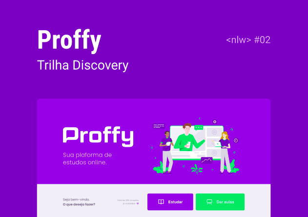
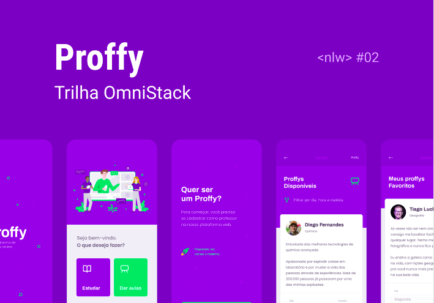

<h1 align="center">
    
</h1>

<h4 align="center"> 
	Proffy - Sua plataforma de estudos online
</h4>

	
  

  
  
  
  
  
  
  

  <a href="#sobre">Projeto</a>&nbsp;&nbsp;&nbsp;|&nbsp;&nbsp;&nbsp;
  <a href="#tecnologia">Tecnologia</a>&nbsp;&nbsp;&nbsp;|&nbsp;&nbsp;&nbsp;
  <a href="#como-usar">Como Usar</a>&nbsp;&nbsp;&nbsp;|&nbsp;&nbsp;&nbsp;
  <a href="#licança">Licença</a>&nbsp;&nbsp;&nbsp;|&nbsp;&nbsp;&nbsp;

# Projeto

O projeto foi desenvolvido na <next_level_week/>#02 oferecido pela [Rocketseat](https://rocketseat.com.br/).  
Se trata de um projeto completo com Back-End (API Rest) e Front-End web e mobile.

<h1 align="center">
  

  
</h1>

A aplicação possibilita que seja cadastrado proffys (professores) e suas respectivas aulas e definir os dias e horário que terão disponibilidade para ministrá-las.

# Tecnologias

### Server (API)

- [Node.JS](https://nodejs.org/en/docs/)
- [TypeScript](https://www.typescriptlang.org/)
- [Express](https://expressjs.com/)
- [SQLite](https://www.sqlite.org/index.html)
- [Knex](http://knexjs.org/)
- [Cors](https://github.com/expressjs/cors)
- [...]

### Web

- [ReactJS](https://reactjs.org/)
- [TypeScript](https://www.typescriptlang.org/)
- [Axios](https://github.com/axios/axios)
- [...]

### Mobile

- [...]

# Como Usar

**Estará disponível no término do projeto**

# Licença

Esse projeto está sob a licença MIT. Veja o arquivo <a href="https://github.com/nathaliacristina20/gorestaurant/blob/master/LICENSE">LICENSE</a> para mais detalhes.

By [Yuri Palacio](https://www.linkedin.com/in/yuri-palacio/) :wave:
